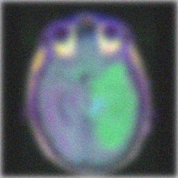
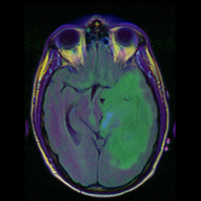

# Deep learning para la superresolución, reducción de ruido, mejora del desenfoque y borrosidad en tomogramas de resonancia magnética

Basado en [Diffusion Model Based Posterior Samplng for Noisy Linear Inverse Problems](https://arxiv.org/abs/2211.12343)


## Resumen
Basado en los modelos de difusión (DM), [Xiangming Meng](https://github.com/mengxiangming/dmps) propone un muestreador posterior de propósito general llamado diffusion model based posterior sampling (DMPS) para abordar los omnipresentes problemas inversos lineales ruidosos y = Ax + n. Para hacer frente a la intratabilidad de la puntuación de verosimilitud exacta perturbada por el ruido, se introduce una puntuación de pseudoverosimilitud simple pero eficaz. Evalua la eficacia de DMPS en una variedad de problemas inversos lineales como la superresolución de imágenes, la eliminación de ruido, la eliminación de borrosidad y desenfoque y el coloreado.


Este trabajo pretende analizar la posible utilidad de DMPS en la aplicación de eliminación de ruido (image denoising), superresolución (super-resolution) y reducción del desenfoque y borrosidad (image deblurring), en imágenes médicas procedentes de resonancia magnética (RMI)


-----------------------------------------------------------------------------------------
Resultado de DMPS en la restauración de imágenes ruidosas.






## Requisitos previos
- python 3.8

- pytorch 1.11.0

- CUDA 11.3.1 (o posterior)


## Primeros pasos 


### Step 1: Set environment

Realice una copia de este repositorio en una unidad DRIVE de google.

Abra mediante google colab el cuaderno jupyter DMPS.ipynb. Ejecútelo en un entorno con GPU. Se instalarán las dependencias, etc.

#### Alternativamente si desea realizar estos primeros pasos manualmente
```
conda create -n DMPS python=3.8

conda activate DMPS

pip install -r requirements.txt

pip install torch==1.11.0+cu113 torchvision==0.12.0+cu113 torchaudio==0.11.0 --extra-index-url https://download.pytorch.org/whl/cu113
```

Si no consigue instalar mpi4py mediante pip install, puede probar conda de la siguiente manera
```
conda install mpi4py
```

Además, es posible que necesite

```
pip install scikit-image
pip install blobfile
```

Por último, asegúrese de que el código se ejecuta en la GPU  


### Step 2:  Download pretrained checkpoint
For FFHQ, download the pretrained checkpoint "ffhq_10m.pt"  from  [link_ffhq_checkpoint](https://drive.google.com/drive/folders/1jElnRoFv7b31fG0v6pTSQkelbSX3xGZh?usp=sharing), and paste it to ./models/


For LSUN bedroom and LSUN cat, download the pretrained checkpoints "lsun_bedroom.pt"  and  "lsun_cat.pt"  from  [link_lsun_checkpoint](https://github.com/openai/guided-diffusion), , and paste it to ./models/

### Step 3:  Prepare the dataset
You need to write your data directory at data.root. Default is ./data/samples which contains three sample images from FFHQ validation set. We also provide other demo data samples in ./data/ used in our paper.

### Step 4: Perform Posterior Sampling for different tasks 

```
python3 main.py \
--model_config=configs/model_config.yaml \
--diffusion_config=configs/diffusion_config.yaml \
--task_config={TASK-CONFIG};
--save_dir './saved_results'
```


## Possible model configurations

```
- configs/model_config.yaml 
- configs/model_config_lsunbedroom.yaml
- configs/model_config_lsuncat.yaml

```


## Possible task configurations
```
# Various linear inverse problems
- configs/sr4_config.yaml
- configs/deblur_gauss_config.yaml
- configs/deblur_uniform_config.yaml
- configs/denoise_config.yaml
- configs/color_config.yaml

```


## Citation 
If you find the code useful for your research, please consider citing as 

```
@article{meng2022diffusion,
  title={Diffusion Posterior Sampling for General Noisy Inverse Problems},
  author={Meng, Xiangming and Kabashima, Yoshiyuki},
  journal={arXiv preprint arXiv:2211.12343},
  year={2022}
}

```


## References

This repo is developed based on  [DPS code](https://github.com/DPS2022/diffusion-posterior-sampling) and  [DDRM code](https://github.com/bahjat-kawar/ddrm). Please also consider citing them if you use this repo. 
```

@inproceedings{kawar2022denoising,
    title={Denoising Diffusion Restoration Models},
    author={Bahjat Kawar and Michael Elad and Stefano Ermon and Jiaming Song},
    booktitle={Advances in Neural Information Processing Systems},
    year={2022}
}

@article{chung2022diffusion,
  title={Diffusion Posterior Sampling for General Noisy Inverse Problems},
  author={Chung, Hyungjin and Kim, Jeongsol and Mccann, Michael T and Klasky, Marc L and Ye, Jong Chul},
  journal={arXiv preprint arXiv:2209.14687},
  year={2022}
}

```
