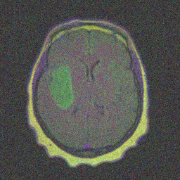
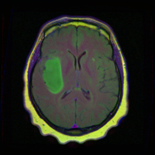
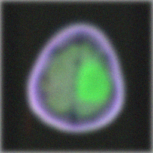
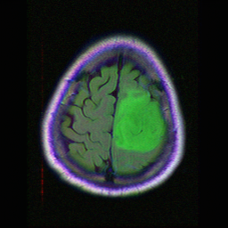
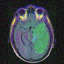
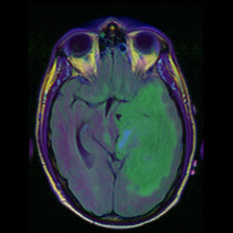

# Deep learning para la superresolución, reducción de ruido, mejora del desenfoque y borrosidad en tomogramas de resonancia magnética

Basado en [Diffusion Model Based Posterior Samplng for Noisy Linear Inverse Problems](https://arxiv.org/abs/2211.12343)


## Resumen
Basado en los modelos de difusión (DM), [Xiangming Meng](https://github.com/mengxiangming/dmps) propone un muestreador posterior de propósito general llamado diffusion model based posterior sampling (DMPS) para abordar los omnipresentes problemas inversos lineales ruidosos y = Ax + n. Para hacer frente a la intratabilidad de la puntuación de verosimilitud exacta perturbada por el ruido, se introduce una puntuación de pseudoverosimilitud simple pero eficaz. Evalua la eficacia de DMPS en una variedad de problemas inversos lineales como la superresolución de imágenes, la eliminación de ruido, la eliminación de borrosidad y desenfoque y el coloreado.


Este trabajo pretende analizar la posible utilidad de DMPS en la aplicación de eliminación de ruido (image denoising), superresolución (super-resolution) y reducción del desenfoque y borrosidad (image deblurring), en imágenes médicas procedentes de resonancia magnética (RMI)


-----------------------------------------------------------------------------------------
Resultado de DMPS en la restauración de imágenes ruidosas (denoising) con ruido gausiano sigma = 0.2 añadido.

| Gaussian noised                                                                                | Reconstrucción                                                                               | Original                                                                                       |
|------------------------------------------------------------------------------------------------|----------------------------------------------------------------------------------------------|------------------------------------------------------------------------------------------------|
|  |  |  |

Resultado de DMPS en la restauración de imágenes borrosas (deblurring) con ruido gausiano sigma = 0.05 añadido.

| Gaussian blured                                                                               | Reconstrucción                                                                               | Original                                                                                       |
|-----------------------------------------------------------------------------------------------|----------------------------------------------------------------------------------------------|------------------------------------------------------------------------------------------------|
|  |  |  |

Resultado de DMPS en la superresolución x4 (Super-Resolution) con ruido gausiano sigma = 0.05 añadido.

| LR -  64x64                                                                                                        | SR x4 - 256x256                                                                                     | Original                                                                                       |
|--------------------------------------------------------------------------------------------------------------------|-----------------------------------------------------------------------------------------------------|------------------------------------------------------------------------------------------------|
|  |  |  |

-----------------------------------------------------------------------------------------

## Requisitos previos
- python 3.8

- pytorch 1.11.0

- CUDA 11.3.1 (o posterior)


## Primeros pasos 


### Paso 1: Configurar el entorno

Realice una copia de este repositorio en una unidad DRIVE de google.

Abra mediante google colab el cuaderno jupyter DMPS.ipynb. Ejecútelo en un entorno con GPU. Se instalarán las dependencias, etc.

#### Alternativamente si desea realizar estos primeros pasos manualmente
```
conda create -n DMPS python=3.8

conda activate DMPS

pip install -r requirements.txt

pip install torch==1.11.0+cu113 torchvision==0.12.0+cu113 torchaudio==0.11.0 --extra-index-url https://download.pytorch.org/whl/cu113
```

Si no consigue instalar mpi4py mediante pip install, puede probar conda de la siguiente manera
```
conda install mpi4py
```

Además, es posible que necesite

```
pip install scikit-image
pip install blobfile
```

Por último, asegúrese de que el código se ejecuta en un entorno con GPU  


### Paso 2: Descargue un punto de control preentrenado

Para el modelo de difusión incondicional de ImageNet con resolución 256x256 de OpenAI descargue 
[256x256_diffusion_uncond.pt](https://openaipublic.blob.core.windows.net/diffusion/jul-2021/256x256_diffusion_uncond.pt), 
para el modelo ADM de difusión incondicional entrenado sobre MRI descargue 
[model080000.pt](https://drive.google.com/file/d/1xw8uKK8OQEYzv2KuUg9wo-vMF7rwjr1D/view?usp=share_link)
y péguelos en ./models/

### Paso 3: Prepare el conjunto de datos
Es necesario que escriba su directorio de datos en data.root. Por defecto es ./data/mri_256_orig que contiene diez imágenes de muestra del conjunto de validación MRI.

### Paso 4: Ejecución del muestreo posterior para diferentes tareas 

```
python3 main.py \
--model_config=configs/model_config_mri.yaml \
--diffusion_config=configs/diffusion_config.yaml \
--task_config=configs/SR_config_mri.yaml \
--save_dir='./saved_results' \
--record \
--video;
```


## Configuración del modelo

```
- configs/model_config_mri.yaml 
```


## Posibles configuraciones de tareas
```
# Diversos problemas lineales inversos
- configs/SR_config_mri.yaml
- configs/denoise_config_mri.yaml
- configs/mri_deblur_gauss_config.yaml
- configs/mri_deblur_uniform_config.yaml
```


## Cita 
Si encuentra el código útil para su investigación, por favor considere citarlo como  

```

```


## Referencias

Este repositorio se ha desarrollado a partir de [código DMPS](https://github.com/mengxiangming/dmps), [código DPS](https://github.com/DPS2022/diffusion-posterior-sampling) y [código DDRM](https://github.com/bahjat-kawar/ddrm). Por favor, considere citarlos si utiliza este repositorio.

```

@article{meng2022diffusion,
  title={Diffusion Posterior Sampling for General Noisy Inverse Problems},
  author={Meng, Xiangming and Kabashima, Yoshiyuki},
  journal={arXiv preprint arXiv:2211.12343},
  year={2022}
}

@inproceedings{kawar2022denoising,
    title={Denoising Diffusion Restoration Models},
    author={Bahjat Kawar and Michael Elad and Stefano Ermon and Jiaming Song},
    booktitle={Advances in Neural Information Processing Systems},
    year={2022}
}

@article{chung2022diffusion,
  title={Diffusion Posterior Sampling for General Noisy Inverse Problems},
  author={Chung, Hyungjin and Kim, Jeongsol and Mccann, Michael T and Klasky, Marc L and Ye, Jong Chul},
  journal={arXiv preprint arXiv:2209.14687},
  year={2022}
}

```
